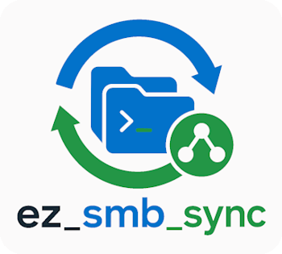

# ez_smb_sync



Mounts a **Samba/CIFS** share and keeps a local folder in sync with it using
**Unison**, driven by a small interactive prompt. Perfect for software
development against virtualized environments (VMWare, VirtualBox, KVM,
QEMU...), where the code lives on your host and has to reach a guest — or the
other way around.

**IMPORTANT:** My life, my work and my passion is free software. Corrections, tweaks and improvements are very welcome (**pull requests** 😉)! Please consider giving us a ⭐, fork, support this project or even visit our professional profile (see [About](#about)). **Thanks!** 🤗

**Support free software and my work!** ❤️🐧

## Table of Contents

- [Layout](#layout)
- [How it works](#how-it-works)
- [Installation](#installation)
   * [1. Prerequisites](#1-prerequisites)
   * [2. Create your configuration profile](#2-create-your-configuration-profile)
   * [3. Give execute permissions](#3-give-execute-permissions)
   * [4. Run it](#4-run-it)
- [Commands](#commands)
- [Configuration parameters](#configuration-parameters)
- [Configuration check](#configuration-check)
- [One way sync (mirroring)](#one-way-sync-mirroring)
- [Safety measures](#safety-measures)
- [Troubleshooting](#troubleshooting)
   * [Crap! The directory can not be mounted!](#crap-the-directory-can-not-be-mounted)
   * [Nothing is synchronized](#nothing-is-synchronized)
   * [Sudo asks for a password on every run](#sudo-asks-for-a-password-on-every-run)
- [Security note](#security-note)
- [About](#about)

## Layout

```
ez_smb_sync/
├── ez_smb_sync.bash        # the engine — mounts, syncs and provides the prompt
├── my_config_model.bash    # configuration profile template (copy it, don't run it)
├── images/
├── .gitignore              # keeps your profiles (with passwords) out of git
├── LICENSE
└── README.md               # this file
```

---

## How it works

You never run `ez_smb_sync.bash` directly. You run **your profile**, and the
profile loads the engine on its last line:

```sh
. ./ez_smb_sync.bash
```

That's why one copy per target works so nicely — each profile carries its own
settings, and the engine is shared. It also means every log line is prefixed
with the **profile name**, so you can tell your terminals apart:

```
--- [[ my_project.bash ]] Trying to mount the network path!
```

The run goes like this:

1. The configuration is validated (see [Configuration check](#configuration-check));
2. The share is mounted with `mount -t cifs` — via `sudo`;
3. An **initial** synchronization runs;
4. The interactive prompt opens, and stays open;
5. On `quit`, a **final** synchronization runs and the share is unmounted.

Because of steps 3 and 5, changes made while the script was running are never
left behind.

---

## Installation

### 1. Prerequisites

`unison` performs the synchronization and `cifs-utils` allows mounting the
share (Debian based example):

```sh
sudo apt-get install unison cifs-utils
```

Arch based example:

```sh
sudo pacman -S --needed unison cifs-utils
```

**NOTE:** `sudo` rights are required, since mounting and unmounting a share
is a privileged operation.

### 2. Create your configuration profile

Copy `my_config_model.bash` and give it a name that identifies the target. Use
one copy per target — that way you keep different settings for different
targets easily.

EXAMPLE

```sh
cp my_config_model.bash my_project.bash
```

**IMPORTANT:** The copy must stay in the **same folder** as
`ez_smb_sync.bash`, because it loads the engine through a relative path.

Now fill in the parameters. Every one of them is documented inline in the
file itself, so it's worth reading it before your first run. See
[Configuration parameters](#configuration-parameters) for the summary.

### 3. Give execute permissions

```sh
chmod a+x ez_smb_sync.bash
chmod 600 my_project.bash && chmod u+x my_project.bash
```

**TIP:** `600` before `u+x` is not redundant — it drops the read permission
of everybody else first, which matters because your profile holds a password.

### 4. Run it

```sh
./my_project.bash
```

... and let the magic happen!

---

## Commands

Type these at the terminal while your profile is running:

| Command | Purpose |
|---|---|
| `sync` | Synchronize according to the `ONE_WAY_SYNC_FROM_REMOTE` parameter |
| `owsfr` | Force a one way sync (mirroring, **CAUTION!**) **from remote** |
| `owsfl` | Force a one way sync (mirroring, **CAUTION!**) **from local** |
| `help` | List the commands above |
| `quit` | Run a final synchronization, unmount the share and exit |

**TIP:** Pressing **Ctrl+D** does exactly what `quit` does, final
synchronization and unmount included.

---

## Configuration parameters

| Parameter | Required | Purpose |
|---|---|---|
| `NET_SHARE_DOMAIN` | Optional | Domain name. Leave it empty when the share does not require one |
| `NET_SHARE_USER` | **Required** | Remote share user name |
| `NET_SHARE_PSW` | **Required** | Remote share password |
| `NET_SHARE_REMOTE` | **Required** | Remote share path, as `//IP_OR_NAME/SHARE_NAME` |
| `DIR_MOUNT_REMOTE` | **Required** | Local folder where the share gets mounted |
| `SYNC_ENABLED` | Optional, default `0` | `1` enables the synchronization, `0` only mounts the share |
| `DIR_MOUNT_SYNC_REMOTE` | Optional | Folder inside the mounted share to sync. Assumes `DIR_MOUNT_REMOTE` when empty |
| `DIR_MOUNT_SYNC_LOCAL` | Required if `SYNC_ENABLED=1` | Local folder to synchronize |
| `ONE_WAY_SYNC_FROM_REMOTE` | Optional, default `1` | `1` mirrors from the share, `0` synchronizes both ways |
| `I_SUPPORT_FREE_SOFTWARE_N_THIS_WORK` | Optional, default `0` | `1` hides the donation notice |

**IMPORTANT:** There must be **no spaces** around the `=` sign. In Bash
`VAR = value` is not an assignment, it is an attempt to run a command
named `VAR`.

---

## Configuration check

The configuration is validated when the script starts, **before anything is
mounted**. Problems are reported all at once, prefixed with `CONFIG ERROR`,
instead of failing later in a way that is hard to diagnose.

Cleaned up automatically:

- Surrounding whitespace of the paths, a common leftover of copying and pasting;
- Trailing slashes of the paths.

The user name, the domain and the password are **never** modified — changing
them would only turn an authentication failure into a confusing one. They are
validated instead.

Reported as errors:

- A comma or a line break in `NET_SHARE_DOMAIN`, `NET_SHARE_USER` or
  `NET_SHARE_PSW`, which would corrupt the option list of `mount`;
- `SYNC_ENABLED` or `ONE_WAY_SYNC_FROM_REMOTE` set to anything other than `0` or `1`;
- A missing `NET_SHARE_USER`, `NET_SHARE_REMOTE` or `DIR_MOUNT_REMOTE`;
- A `NET_SHARE_REMOTE` that is not in the `//IP_OR_NAME/SHARE_NAME` form;
- A `DIR_MOUNT_REMOTE` or `DIR_MOUNT_SYNC_LOCAL` that is not an existing directory;
- A `DIR_MOUNT_SYNC_REMOTE` outside of `DIR_MOUNT_REMOTE`, which would leave it
  out of the share;
- A `DIR_MOUNT_SYNC_LOCAL` inside `DIR_MOUNT_REMOTE`, which would make Unison
  fight against its own changes;
- A missing `unison` (when `SYNC_ENABLED=1`) or a missing `mount.cifs`.

---

## One way sync (mirroring)

A one way sync is a **mirroring**, not a copy. Files that exist **only** on
the destination side are **deleted**, so that it becomes identical to the
source.

| Mode | Source of truth | What happens to files that exist only on the other side |
|---|---|---|
| `ONE_WAY_SYNC_FROM_REMOTE=1` (default) | The share | Deleted from the local folder |
| `ONE_WAY_SYNC_FROM_REMOTE=0` | Both | Kept — new files propagate in both directions |
| `owsfr` command | The share | Deleted from the local folder |
| `owsfl` command | The local folder | Deleted from the share |

**IMPORTANT:** `owsfr` and `owsfl` ignore `ONE_WAY_SYNC_FROM_REMOTE` and
mirror right away. Be sure of the direction before typing them.

---

## Safety measures

- A synchronization only runs when the mount point is **really mounted** and
  **not empty**. That prevents a dropped share — which turns the mount point
  back into an ordinary empty folder — from being mirrored as a mass deletion;
- Permissions are ignored (`-perms 0`), which is required on CIFS;
- The share is unmounted on exit, so nothing is left hanging.

---

## Troubleshooting

### Crap! The directory can not be mounted!

The `mount` command failed. In order of likelihood:

1. Wrong user name, password or domain;
2. The guest is unreachable — check the IP with `ping`, and check the
   firewall of the remote machine;
3. The share name is wrong. List what the server offers:

   ```sh
   smbclient -L //IP_OR_NAME -U user_name
   ```

4. The SMB protocol version is too old for your kernel. Some old guests need
   an explicit `vers=1.0`, which this script does not set.

### Nothing is synchronized

Check, in this order:

1. `SYNC_ENABLED` is `1`;
2. The share is really mounted — `mountpoint /your/mount/folder`;
3. The folder being synchronized is **not empty**, since an empty source
   aborts the synchronization on purpose (see [Safety measures](#safety-measures)).

### Sudo asks for a password on every run

That's expected — mounting is privileged. The message below is not an error,
it just means a previous run left the share mounted:

```
--- [[ my_project.bash ]] Hey! The remote directory is already mounted! ;)
```

---

## Security note

Your profile holds the share password **in plain text**. Keep it out of
version control and restrict its permissions with `chmod 600 my_project.bash`.

The provided `.gitignore` already ignores every `*.bash` file except
`ez_smb_sync.bash` and `my_config_model.bash`, so your profiles are not
committed by accident.

## About

ez_smb_sync 🄯 BSD-3-Clause  
Eduardo Lúcio Amorim Costa  
Brazil-ES  
https://www.linkedin.com/in/eduardo-software-livre/


